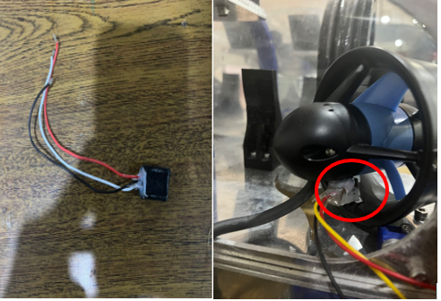

# Sistem-Odometri-Robot-Bawah-Air-Berbasis-Encoder-Thruster-Controller-ETC-untuk-Estimasi-Posisi

  

    
Sistem odometri merupakan metode fundamental dalam navigasi robot untuk mengestimasi jarak tempuh berdasarkan gerakan mekanis. Pada robot bawah air seperti Autonomous Underwater Vehicle (AUV), salah satu pendekatan yang digunakan adalah sistem odometri berbasis Encoder Thruster Controller (ETC). ETC berfungsi untuk mendeteksi dan menghitung jumlah rotasi dari thruster yang digunakan untuk mendorong robot di dalam air. Setiap kali thruster berputar, ETC menghasilkan pulsa digital yang mencerminkan seberapa banyak putaran telah terjadi selama pergerakan.

Proses awal dimulai dengan pemasangan sensor encoder pada poros atau sistem penggerak thruster. Saat motor thruster aktif, gerakan rotasi dari baling-baling menghasilkan pulsa yang dibaca oleh ETC. Jumlah pulsa ini bersifat proporsional terhadap durasi dan intensitas kerja thruster. Semakin lama dan cepat thruster beroperasi, semakin banyak pulsa yang tercatat. Namun, karena dorongan air dan efisiensi mekanik dari sistem thruster tidak selalu linier terhadap jumlah pulsa, maka diperlukan metode kalibrasi untuk mengkonversi pulsa menjadi nilai jarak yang akurat.

Salah satu metode yang digunakan adalah regresi linier, yaitu pendekatan statistik yang memodelkan hubungan antara jumlah pulsa ETC dan jarak aktual yang ditempuh oleh robot. Untuk melakukan ini, diperlukan tahap pengumpulan data eksperimental di mana robot dijalankan dalam lintasan lurus dengan berbagai durasi dan kecepatan. Setiap percobaan mencatat jumlah pulsa yang dihasilkan dan jarak tempuh aktual yang diukur secara manual atau menggunakan alat ukur eksternal.

Dari data tersebut, dibentuk persamaan regresi linier dalam bentuk:
Jarak = a × Pulsa + b,
di mana a adalah koefisien kemiringan (slope) dan b adalah konstanta. Persamaan ini kemudian digunakan dalam program mikrokontroler atau sistem pengolah data untuk secara otomatis menghitung jarak tempuh robot berdasarkan jumlah pulsa yang dibaca dari ETC.

Keunggulan dari pendekatan ini adalah kemudahan implementasi dan efisiensi dalam menghitung jarak tempuh secara real-time tanpa membutuhkan sensor tambahan atau sistem komputasi yang kompleks. Selain itu, sistem berbasis regresi juga memungkinkan untuk penyesuaian dan peningkatan akurasi dengan melakukan kalibrasi ulang secara berkala sesuai dengan kondisi lingkungan atau perubahan performa mekanis thruster.

Dengan adanya sistem odometri berbasis ETC dan regresi ini, AUV dapat memantau seberapa jauh telah bergerak dengan cara yang sederhana namun efektif. Sistem ini sangat berguna terutama dalam skenario kompetisi, pengujian laboratorium, atau aplikasi penelitian di mana pemantauan jarak tempuh secara mandiri diperlukan tanpa ketergantungan pada sinyal eksternal seperti GPS atau visual positioning.
